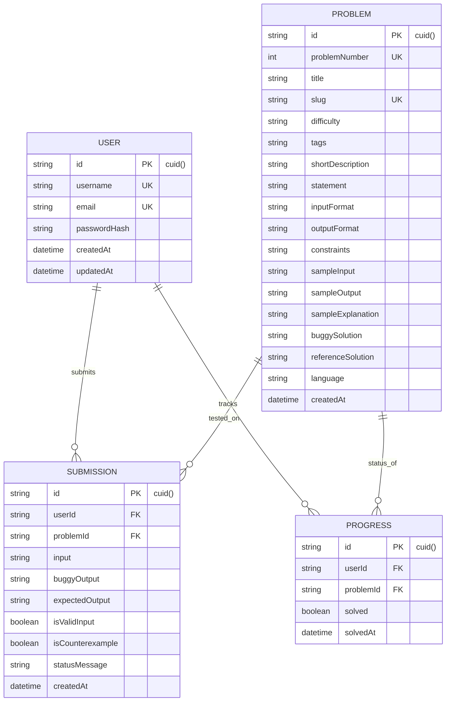

# PROJECT UNDERSTANDING & TECHNICAL ARCHITECTURE GUIDE: BREAKCASE V1

> **"After reading this document, I should understand what this project does, what technologies it uses, how the pieces connect, and where I should go in the code when I want to understand or modify something."**

---

## 1. START WITH THE BIG PICTURE

### What is this project?
**BreakCase** is a competitive-programming training platform built around a unique debugging concept:

> **"The solution looks correct. Your job is to break it."**

Instead of asking users to write algorithmic solutions from scratch, BreakCase provides:
1. A competitive-programming problem statement with constraints and sample cases.
2. A provided **C++17** solution that appears correct, compiles cleanly, and passes sample test cases.
3. The user's goal: Find **ONE valid input counterexample within constraints** that causes the provided C++ solution to fail (produce wrong output or crash).

### Simple 3–5 Sentence Explanation for a Student
> BreakCase is a web application designed to help developers practice finding edge cases and subtle logical bugs in code. Instead of writing code, you inspect a suspicious C++ solution that passes basic sample tests, analyze its logic for hidden assumptions or off-by-one errors, and type in a single test case that breaks it. When you submit your test case, the server compiles and executes both the buggy C++ solution and a trusted reference C++ solution in a sandboxed environment, compares their outputs, and updates your progress if you successfully broke the solution.

### Current Stage of Development
- **Stage**: V1 Functional Core (Complete working prototype with 5 handcrafted C++ problems).
- **Current User Capabilities**:
  - Register an account (username, email, password).
  - Log in and maintain an authenticated session via JWT.
  - View the problem dashboard showing 5 competitive-programming problems with difficulty badges and solved/unsolved status.
  - Open a problem page with a Codeforces/LeetCode-inspired split-panel interface.
  - Inspect the provided C++ solution, problem statement, constraints, and sample cases.
  - Submit custom test case inputs and receive real-time execution feedback (✓ Counterexample Found, ✗ Not a Counterexample, or Invalid Test Case).
  - Toggle between Light Mode (Codeforces-inspired) and Dark Mode (LeetCode-inspired).
  - View user progress summary (`2 / 5 Problems Solved`).

### Status Categorization

#### ✅ IMPLEMENTED
- User Registration & Password Hashing (bcryptjs)
- User Authentication & JWT Session Tokens
- Database persistence via Prisma ORM & SQLite
- 5 Handcrafted C++ Problems with Buggy & Reference code seeded
- Server-side input constraint validation per problem
- Server-side C++ compilation (`g++ -O2 -std=c++17`) & execution sandbox (2s CPU timeout, 1MB output cap)
- Real-time output comparison & solved state tracking
- Desktop 2-column split-panel layout & Mobile stacked layout
- Theme switching (Light / Dark mode persisted in `localStorage`)
- User progress page

#### ⚠️ PARTIAL
- Monaco Code Editor integration (used for C++ code viewer; counterexample input box uses a styled monospace textarea).

#### ⚠️ PRESENT BUT NOT CURRENTLY USED
- `client/src/App.css` (Present in Vite template, but custom styles and themes are handled via `client/src/index.css` & Tailwind CSS).
- `prisma/dev.db-journal` (Temporary SQLite WAL log file created during DB writes).

#### 💡 PLANNED / CONCEPTUAL
- User rank / Rating system
- Global leaderboard
- Multiple programming language support (Python, Java, Go)
- Community problem submission / Custom problem generator
- OTP / OAuth / Email verification / Password reset

---

## 2. TECH STACK

Here are the actual technologies used in the repository:

```
                  ┌──────────────────────────────────────────┐
                  │                 FRONTEND                 │
                  │   React 19 + TypeScript + Vite + Tailwind │
                  │   Monaco Editor + Lucide Icons + Router  │
                  └────────────────────┬─────────────────────┘
                                       │ HTTP REST API (JSON)
                                       ▼
                  ┌──────────────────────────────────────────┐
                  │                 BACKEND                  │
                  │   Node.js + Express.js + TypeScript      │
                  │   JWT Auth + Bcryptjs + Validation       │
                  └──────────┬────────────────────┬──────────┘
                             │                    │
          Prisma ORM Queries │                    │ C++ Execution (`g++`)
                             ▼                    ▼
                  ┌────────────────────┐┌────────────────────┐
                  │      DATABASE      ││  C++ RUNNER ENGINE │
                  │   SQLite (dev.db)  ││ Compiled Binaries  │
                  └────────────────────┘└────────────────────┘
```

### Frontend

#### React 19 (`react`, `react-dom`)
- **What is it?**: A JavaScript library for building component-based user interfaces.
- **Why is it used HERE?**: Allows building interactive, stateful UI components like the split-panel problem layout, theme toggle, and real-time execution feedback.
- **What does it do in the project?**: Powers all user interface rendering in `client/src/App.tsx`, `client/src/pages/`, and `client/src/components/`.

#### TypeScript (`typescript`)
- **What is it?**: A strongly typed superset of JavaScript that catches type errors at compile time.
- **Why is it used HERE?**: Enforces strict typings for `Problem`, `User`, `Submission`, and `TestResult` objects across frontend and backend.
- **What does it do in the project?**: Defines interfaces in `client/src/types/index.ts` and type-checks code before Vite builds `dist/`.

#### Vite (`vite`, `@vitejs/plugin-react`)
- **What is it?**: A fast frontend build tool and local development server.
- **Why is it used HERE?**: Replaces slow legacy bundlers (like Webpack) with instant hot module replacement (HMR) and fast build times.
- **What does it do in the project?**: Serves the frontend at `http://localhost:3000` during dev and proxies API calls `/api` to backend at `http://localhost:5001` (`client/vite.config.ts`).

#### Tailwind CSS v4 (`tailwindcss`, `@tailwindcss/vite`)
- **What is it?**: A utility-first CSS framework for rapid UI styling.
- **Why is it used HERE?**: Enables custom dark and light themes (LeetCode dark slate & Codeforces light white/navy) without writing verbose custom CSS classes.
- **What does it do in the project?**: Styles all layouts, buttons, cards, borders, and dark mode transitions in `client/src/index.css`.

#### Monaco Editor (`@monaco-editor/react`)
- **What is it?**: The browser-based code editor engine that powers VS Code.
- **Why is it used HERE?**: Provides high-quality C++ syntax highlighting, line numbers, and theme switching for inspecting suspicious C++ solutions.
- **What does it do in the project?**: Embedded inside `client/src/components/CodeViewer.tsx`.

#### Lucide Icons (`lucide-react`)
- **What is it?**: A modern icon library for React apps.
- **Why is it used HERE?**: Renders clean developer-tool icons (terminal, checkmarks, warning triangles, sun/moon, arrows).
- **What does it do in the project?**: Used across `Navbar.tsx`, `ProblemCard.tsx`, `ProblemPage.tsx`, and `ThemeToggle.tsx`.

#### React Router v7 (`react-router-dom`)
- **What is it?**: Client-side routing library for single-page applications (SPAs).
- **Why is it used HERE?**: Handles navigation between Landing, Login, Register, Dashboard, Problem, and Progress pages without full page reloads.
- **What does it do in the project?**: Configured in `client/src/App.tsx`.

---

### Backend

#### Node.js & Express.js (`express`)
- **What is it?**: Node.js is a JavaScript runtime; Express is a lightweight web framework for building REST APIs.
- **Why is it used HERE?**: Provides fast asynchronous I/O to handle HTTP requests, input validation, authentication, and execution of subprocesses.
- **What does it do in the project?**: Defines the REST server in `server/src/index.ts` listening on port `5001`.

#### TypeScript & `ts-node-dev`
- **What is it?**: `ts-node-dev` automatically restarts the Node server when backend TypeScript files change.
- **Why is it used HERE?**: Speeds up backend development without manual compilation.
- **What does it do in the project?**: Configured in `server/package.json` under `"scripts": { "dev": "..." }`.

#### JWT (`jsonwebtoken`)
- **What is it?**: JSON Web Token standard for stateless authentication.
- **Why is it used HERE?**: Allows the backend to verify logged-in users without storing session states in memory.
- **What does it do in the project?**: Signed in `authController.ts` upon login/register, verified in `authMiddleware.ts`.

#### Bcryptjs (`bcryptjs`)
- **What is it?**: A password-hashing library implementing the blowfish cipher.
- **Why is it used HERE?**: Passwords must NEVER be stored as plain text.
- **What does it do in the project?**: Hashes passwords with 10 salt rounds in `authController.ts`.

---

### Database

#### SQLite (`prisma/dev.db`)
- **What is it?**: A file-based relational database engine requiring zero server setup.
- **Why is it used HERE?**: Enables the application to run out-of-the-box on any local developer machine without requiring a running PostgreSQL server.
- **What does it do in the project?**: Stores all users, problems, submissions, and progress records in `prisma/dev.db`.

#### Prisma ORM (`@prisma/client`, `prisma`)
- **What is it?**: A type-safe Object-Relational Mapper for database queries and migrations.
- **Why is it used HERE?**: Replaces manual SQL queries with auto-generated TypeScript database methods (`prisma.user.findUnique`, `prisma.progress.upsert`).
- **What does it do in the project?**: Configured in `prisma/schema.prisma`, instantiated in `server/src/db.ts`.

---

### Execution Sandbox Engine

#### System C++ Compiler (`/usr/bin/g++`)
- **What is it?**: GNU C++ Compiler installed on host operating system.
- **Why is it used HERE?**: Compiles C++17 code (`g++ -O2 -std=c++17`) for buggy and reference solutions.
- **What does it do in the project?**: Invoked via Node `child_process.exec` in `server/src/services/executionService.ts`.

---

## 3. THE MOST IMPORTANT DIAGRAM

```
  [User Browser]
       │
       │ (1) Enters input & clicks "Break It"
       ▼
  [React App: ProblemPage.tsx]
       │
       │ (2) POST /api/problems/:id/test { input: "..." }
       ▼
  [Express Router: problemRoutes.ts]
       │
       │ (3) Forwards request
       ▼
  [Controller: ProblemController.ts]
       │
       ├──► (4) Validate input format & bounds ──► [ValidationService.ts]
       │                                                 │
       │                                    (Invalid?) ──┴──► Return 400 Bad Request
       │
       ├──► (5) Compile & Run C++ Binaries ──► [ExecutionService.ts]
       │                                                 │
       │                                                 ├──► g++ compile buggy & ref code
       │                                                 ├──► Run child processes (stdin/stdout)
       │                                                 └──► Compare outputs (isCounterexample?)
       │
       ├──► (6) Write Submission & Progress ──► [Prisma ORM (db.ts)]
       │                                                 │
       │                                                 └──► UPDATE sqlite dev.db
       │
       ▼
  (7) Return JSON Response { valid: true, broken: true, expectedOutput: "...", actualOutput: "..." }
       │
       ▼
  [React App: ProblemPage.tsx] ──► (8) Re-renders UI with "✓ COUNTEREXAMPLE FOUND" success banner!
```

### Explanation of Every Arrow:
1. **User $\to$ React App (`ProblemPage.tsx`)**: User types an input string in the counterexample box and clicks "Break It".
2. **React App $\to$ Express Server**: `api.testCounterexample()` sends an HTTP `POST` request containing `{ input: "..." }` and `Authorization: Bearer <token>` header to `/api/problems/:id/test`.
3. **Express Router $\to$ Controller**: `problemRoutes.ts` passes request to `ProblemController.testCounterexample`.
4. **Controller $\to$ ValidationService**: `ValidationService.validateInput(problemNumber, input)` checks line formats, token counts, and constraint limits (e.g. $1 \le N \le 10^5$). If invalid, immediately returns HTTP 400 with a description of the violated constraint.
5. **Controller $\to$ ExecutionService**:
   - `ExecutionService.compileCpp()` invokes `g++ -O2 -std=c++17` to compile buggy C++ code and reference C++ code into binary executables in `scratch/bin/`.
   - `ExecutionService.runBinary()` spawns child processes, feeds the user's input string to `stdin`, enforces a 2000ms CPU timeout limit, and captures `stdout`.
   - `isCounterexample` is calculated (`buggyOutput !== expectedOutput`).
6. **Controller $\to$ Database (Prisma)**: If user is authenticated and `isCounterexample === true`, `ProblemController` calls `prisma.progress.upsert()` to mark the problem as `solved: true` in SQLite.
7. **Express Server $\to$ React App**: Server returns a JSON payload containing `{ valid: true, broken: true, expectedOutput: "...", actualOutput: "..." }`.
8. **React App $\to$ UI**: React state updates, showing the green "✓ COUNTEREXAMPLE FOUND" banner and updating the problem status badge to Solved!

---

## 4. FOLDER STRUCTURE — VERY IMPORTANT

### Repository Tree
```text
BreakCase/
├── client/                             # Frontend React single-page application
│   ├── index.html                      # HTML entrypoint
│   ├── vite.config.ts                  # Vite build config & proxy to port 5001
│   ├── package.json                    # Frontend dependencies
│   └── src/
│       ├── App.tsx                     # Main React application component & route definitions
│       ├── main.tsx                    # React DOM root entrypoint
│       ├── index.css                   # Tailwind CSS import & custom CSS variable design tokens
│       ├── components/
│       │   ├── Navbar.tsx              # Top navigation bar (Logo, Links, User badge, Theme toggle)
│       │   ├── CodeViewer.tsx          # Monaco Editor component for syntax-highlighted C++ code
│       │   ├── ProblemCard.tsx         # Dashboard problem summary card component
│       │   └── ThemeToggle.tsx         # Dark / Light theme toggle button
│       ├── context/
│       │   ├── AuthContext.tsx         # React Context for logged-in user state & auth methods
│       │   └── ThemeContext.tsx        # React Context for Dark/Light mode DOM theme management
│       ├── pages/
│       │   ├── LandingPage.tsx         # Public marketing/landing page before login
│       │   ├── LoginPage.tsx           # User sign-in page
│       │   ├── RegisterPage.tsx        # User registration page
│       │   ├── DashboardPage.tsx       # Main problem grid dashboard page
│       │   ├── ProblemPage.tsx         # Core split-panel problem view & submission interface
│       │   └── ProgressPage.tsx        # User problem completion summary page
│       ├── services/
│       │   └── api.ts                  # Fetch API wrapper for all backend REST endpoints
│       └── types/
│           └── index.ts                # TypeScript interface definitions (Problem, User, etc.)
│
├── server/                             # Backend Express REST server
│   ├── package.json                    # Backend dependencies & scripts
│   ├── tsconfig.json                   # TypeScript compiler configuration for server
│   ├── .env                            # Environment variables (PORT=5001, DATABASE_URL, JWT_SECRET)
│   └── src/
│       ├── index.ts                    # Express application entrypoint & listener
│       ├── config.ts                   # Environment configuration loader
│       ├── db.ts                       # Prisma Client singleton export
│       ├── controllers/
│       │   ├── authController.ts       # Register, Login, Logout, GetMe endpoints logic
│       │   ├── problemController.ts    # Problem listing, details, and counterexample test execution
│       │   └── progressController.ts   # User progress calculation endpoint logic
│       ├── middleware/
│       │   └── authMiddleware.ts       # JWT token verification middleware (authenticateToken, optionalAuth)
│       ├── routes/
│       │   ├── authRoutes.ts           # Authentication route endpoints router
│       │   ├── problemRoutes.ts        # Problem route endpoints router
│       │   └── progressRoutes.ts       # Progress route endpoints router
│       └── services/
│           ├── executionService.ts     # C++ g++ compilation & sandboxed child_process runner
│           └── validationService.ts    # Input format & constraint parsing logic for all 5 problems
│
├── prisma/                             # Database schema & seeding configuration
│   ├── schema.prisma                   # Prisma database model definitions (User, Problem, Submission, Progress)
│   ├── seed.ts                         # Database seeder script populating 5 C++ problems
│   └── dev.db                          # SQLite database file
│
├── scratch/                            # Compiled C++ binaries & automated verification test scripts
│   ├── bin/                            # System directory storing compiled C++ executables
│   ├── test_suite.js                   # End-to-end basic automated test script
│   └── test_all_problems.js            # Comprehensive 5-problem counterexample verification test script
│
├── .env                                # Root environment variables
├── .gitignore                          # Git ignore definitions
├── package.json                        # Root monorepo configuration scripts
├── README.md                           # Quick setup & architectural summary documentation
└── PROJECT_UNDERSTANDING.md            # Comprehensive project guide (this document)
```

---

## 5. WHERE DO I GO? MAP

| If I want to understand or modify... | Open this file / folder | Why |
| :--- | :--- | :--- |
| User Login Logic | [`server/src/controllers/authController.ts`](file:///Users/akshayaverma/Documents/BreakCase/server/src/controllers/authController.ts#L61-L108) | Handles password verification with bcrypt and signs JWT tokens. |
| User Registration Logic | [`server/src/controllers/authController.ts`](file:///Users/akshayaverma/Documents/BreakCase/server/src/controllers/authController.ts#L8-L59) | Validates new user input, checks duplicates, hashes password, and creates User record. |
| C++ Compiler & Sandboxed Runner | [`server/src/services/executionService.ts`](file:///Users/akshayaverma/Documents/BreakCase/server/src/services/executionService.ts) | Invokes `g++ -O2 -std=c++17`, manages process timeouts (2s), output caps (1MB), and compares outputs. |
| Input Constraint Validators | [`server/src/services/validationService.ts`](file:///Users/akshayaverma/Documents/BreakCase/server/src/services/validationService.ts) | Contains validation rules checking if custom user input satisfies problem limits for all 5 problems. |
| Database Schema & Models | [`prisma/schema.prisma`](file:///Users/akshayaverma/Documents/BreakCase/prisma/schema.prisma) | Defines database tables (`users`, `problems`, `submissions`, `progress`), relationships, and indexes. |
| Problem Seeding / Problem Data | [`prisma/seed.ts`](file:///Users/akshayaverma/Documents/BreakCase/prisma/seed.ts) | Contains full text, statements, constraints, sample cases, buggy C++ code, and reference C++ code for all 5 problems. |
| Main Problem Solving Page | [`client/src/pages/ProblemPage.tsx`](file:///Users/akshayaverma/Documents/BreakCase/client/src/pages/ProblemPage.tsx) | Implements the 2-column desktop split panel, statement viewer, C++ code viewer, input editor, and feedback callout. |
| Problem Dashboard | [`client/src/pages/DashboardPage.tsx`](file:///Users/akshayaverma/Documents/BreakCase/client/src/pages/DashboardPage.tsx) | Fetches problem list, computes solved progress percentage, and renders the 5 problem cards. |
| Dark / Light Theme System | [`client/src/context/ThemeContext.tsx`](file:///Users/akshayaverma/Documents/BreakCase/client/src/context/ThemeContext.tsx) & [`client/src/index.css`](file:///Users/akshayaverma/Documents/BreakCase/client/src/index.css) | Manages `.dark` class toggle on `document.documentElement` and CSS variable color tokens. |
| API Route Middleware (JWT) | [`server/src/middleware/authMiddleware.ts`](file:///Users/akshayaverma/Documents/BreakCase/server/src/middleware/authMiddleware.ts) | Extracts JWT from Authorization header, verifies signature, and attaches `req.user`. |
| Frontend API Service | [`client/src/services/api.ts`](file:///Users/akshayaverma/Documents/BreakCase/client/src/services/api.ts) | Centralized fetch wrapper adding JWT `Authorization: Bearer <token>` header to backend requests. |

---

## 6. TRACE ONE COMPLETE USER ACTION

### Tracing: User Submits Counterexample Input to Break a Problem

```
User types "-15 -3 -42" & clicks "Break It"
  │
  ▼
client/src/pages/ProblemPage.tsx ──► handleSubmit()
  │
  ▼
client/src/services/api.ts ──► api.testCounterexample(problemId, input)
  │
  │ HTTP POST /api/problems/:id/test
  ▼
server/src/routes/problemRoutes.ts ──► router.post('/:id/test', optionalAuth, ProblemController.testCounterexample)
  │
  ▼
server/src/controllers/problemController.ts ──► testCounterexample(req, res)
  │
  ├──► ValidationService.validateInput(1, "-15 -3 -42")
  │      └── Returns { valid: true }
  │
  ├──► ExecutionService.runCounterexampleTest(problemId, buggyCpp, refCpp, input)
  │      ├── compileCpp(buggyCpp) ──► exec("g++ -O2 ...") ──► scratch/bin/prob_..._buggy
  │      ├── compileCpp(refCpp)   ──► exec("g++ -O2 ...") ──► scratch/bin/prob_..._ref
  │      ├── runBinary(buggyBin, input) ──► child_process.execFile() ──► stdout: "0"
  │      ├── runBinary(refBin, input)   ──► child_process.execFile() ──► stdout: "-3"
  │      └── isCounterexample = ("0" !== "-3") ──► TRUE!
  │
  ├──► prisma.submission.create({ ... }) ──► Saves attempt in SQLite
  ├──► prisma.progress.upsert({ ... })   ──► Sets solved = true in SQLite
  │
  ▼
Returns JSON: { valid: true, broken: true, expectedOutput: "-3", actualOutput: "0", message: "✓ Counterexample Found!..." }
  │
  ▼
client/src/pages/ProblemPage.tsx ──► setResult(res) & setProblem(solved: true)
  │
  ▼
React re-renders: Displays green "✓ COUNTEREXAMPLE FOUND" success box!
```

---

## 7. FRONTEND — EXPLAIN FROM ZERO

### How the Frontend Application Starts
1. **Entrypoint**: `client/index.html` loads `/src/main.tsx`.
2. **Mounting**: `client/src/main.tsx` mounts `<App />` inside `<div id="root"></div>`.
3. **Providers**: `client/src/App.tsx` wraps the router in `<ThemeProvider>` (for Dark/Light mode) and `<AuthProvider>` (for session state).

### How Pages & Routing Work
`client/src/App.tsx` uses React Router v7 to define page paths:
- `/` $\to$ `LandingPage.tsx` (Public landing hero)
- `/login` $\to$ `LoginPage.tsx` (Public only route; redirects to `/problems` if logged in)
- `/register` $\to$ `RegisterPage.tsx` (Public only route)
- `/problems` $\to$ `DashboardPage.tsx` (Main problem listing)
- `/problems/:slug` $\to$ `ProblemPage.tsx` (Dynamic split-panel view for a specific problem)
- `/progress` $\to$ `ProgressPage.tsx` (Protected route; requires authentication)

### How State and API Calls Work
- `AuthContext.tsx` checks `localStorage.getItem('breakcase_token')` on app startup. If present, calls `api.getMe()` to restore the logged-in user profile.
- Component state (e.g. `inputVal`, `evaluating`, `result` in `ProblemPage.tsx`) manages local UI form interactions.
- When an API request is made, `client/src/services/api.ts` attaches the token in the `Authorization: Bearer <token>` header, parses the JSON response, and returns typed data.

---

## 8. BACKEND — EXPLAIN FROM ZERO

### How the Server Starts
1. **Entrypoint**: `server/src/index.ts` loads environment configuration from `server/src/config.ts`.
2. **Middleware Pipeline**:
   - `cors()` allows frontend requests from `http://localhost:3000`.
   - `express.json()` parses incoming HTTP JSON request bodies.
3. **Router Mounting**:
   - `/api/auth` $\to$ `authRoutes.ts`
   - `/api/problems` $\to$ `problemRoutes.ts`
   - `/api/progress` $\to$ `progressRoutes.ts`
4. **Listening**: Server starts listening on `http://localhost:5001`.

### Request Lifecycle
`HTTP Request` $\to$ `authMiddleware` (optional or required) $\to$ `Route handler` $\to$ `Controller method` $\to$ `Service helper` (Validation/Execution) $\to$ `Prisma DB Query` $\to$ `JSON Response`.

---

## 9. DATABASE — EXPLAIN THE ACTUAL SCHEMA

The project uses a relational schema defined in `prisma/schema.prisma`:



### Table Explanations

#### `users` (`User`)
- **Purpose**: Stores user account credentials and profile info.
- **Fields**: `id` (PK, cuid), `username` (Unique), `email` (Unique), `passwordHash` (Bcrypt hash), `createdAt`, `updatedAt`.

#### `problems` (`Problem`)
- **Purpose**: Stores competitive-programming problem statements and C++ source code.
- **Fields**: `id` (PK, cuid), `problemNumber` (Unique integer 1..5), `title`, `slug` (Unique), `difficulty`, `tags`, `shortDescription`, `statement`, `inputFormat`, `outputFormat`, `constraints`, `sampleInput`, `sampleOutput`, `sampleExplanation`, `buggySolution` (Flawed C++ code shown to user), `referenceSolution` (Secret correct C++ code), `language` (default "cpp"), `createdAt`.

#### `submissions` (`Submission`)
- **Purpose**: Logs every test attempt submitted by users.
- **Fields**: `id` (PK), `userId` (FK $\to$ `users.id`), `problemId` (FK $\to$ `problems.id`), `input`, `buggyOutput`, `expectedOutput`, `isValidInput`, `isCounterexample`, `statusMessage`, `createdAt`.
- **Indexes**: Indexed on `userId` and `problemId` for fast lookup.

#### `progress` (`Progress`)
- **Purpose**: Tracks whether a user has solved a specific problem.
- **Fields**: `id` (PK), `userId` (FK), `problemId` (FK), `solved` (Boolean), `solvedAt` (Timestamp).
- **Constraints**: Unique constraint on `[userId, problemId]` to prevent duplicate progress records per user.

---

## 10. DATABASE CONCEPTS I NEED TO UNDERSTAND

1. **Primary Key (PK)**: A unique identifier for every row in a table. In our schema, `id` fields use `cuid()` (Collision-Resistant Unique Identifier strings).
2. **Foreign Key (FK)**: A field in one table referencing the Primary Key of another table (e.g. `userId` in `submissions` references `id` in `users`).
3. **One-to-Many Relationship**: One `User` can have many `Submission` records. One `Problem` can have many `Submission` records.
4. **Unique Constraint (`@unique`)**: Ensures no two rows have the same value (e.g. `email`, `username`, `slug`, or compound `[userId, problemId]`).
5. **Index (`@@index`)**: B-tree database structure that drastically speeds up filtering queries (`where: { userId }`).
6. **Cascade Delete (`onDelete: Cascade`)**: If a user account is deleted, all associated `submissions` and `progress` records are automatically removed by SQLite.
7. **Upsert**: A combined operation that inserts a new record if it does not exist, or updates it if it already exists (`prisma.progress.upsert`).

---

## 11. AUTHENTICATION & AUTHORIZATION

```
Register/Login ──► Generate JWT Token ──► Save in localStorage ──► Pass header "Authorization: Bearer <token>" ──► authMiddleware.ts verifies ──► req.user attached
```

### Authentication vs Authorization
- **Authentication ("Who are you?")**: Handled by `POST /api/auth/login` and `authMiddleware.ts`. Verifies the user's password hash and validates their JWT signature.
- **Authorization ("What are you allowed to do?")**: Handled by protected route guards (`ProtectedRoute` in React and `authenticateToken` in Express). For example, unauthenticated users can view problem statements, but must be authenticated to record solved progress on `/progress`.

---

## 12. API MAP

| Method | Endpoint | Purpose | Auth Required? | Request Body | Response Payload |
| :--- | :--- | :--- | :--- | :--- | :--- |
| `POST` | `/api/auth/register` | Create a new user account | No | `{ username, email, password }` | `{ message, token, user }` |
| `POST` | `/api/auth/login` | Authenticate user & get JWT | No | `{ identifier, password }` | `{ message, token, user }` |
| `POST` | `/api/auth/logout` | End user session | No | None | `{ message: "Logged out..." }` |
| `GET` | `/api/auth/me` | Fetch active user profile | Yes | None | `{ user: { id, username, email } }` |
| `GET` | `/api/problems` | List all 5 problems + solved status | Optional | None | `{ problems: [...] }` |
| `GET` | `/api/problems/:slug` | Get details for single problem | Optional | None | `{ problem: { ... } }` |
| `POST` | `/api/problems/:id/test` | Submit counterexample & evaluate | Optional | `{ input: "..." }` | `{ valid, broken, expectedOutput, actualOutput, message }` |
| `GET` | `/api/progress` | Get user solved statistics | Yes | None | `{ totalProblems: 5, solvedCount, progress: [...] }` |

---

## 13. EXPLAIN THE MOST IMPORTANT FILES

### 🔥 MUST UNDERSTAND

1. **`server/src/services/executionService.ts`**
   - *What it does*: Compiles C++ code (`g++ -O2 -std=c++17`), runs child processes with 2s timeouts, captures output, and determines if a counterexample broke the solution.
   - *Why it matters*: Core engine of BreakCase.
2. **`server/src/controllers/problemController.ts`**
   - *What it does*: Handles requests for problem listing, details, and processing test counterexample submissions.
   - *Why it matters*: Connects HTTP requests to validation, C++ execution, and database updates.
3. **`client/src/pages/ProblemPage.tsx`**
   - *What it does*: Main problem-solving page UI (2-column layout, C++ viewer, counterexample editor, feedback modal).
   - *Why it matters*: The central user experience page.
4. **`prisma/schema.prisma`**
   - *What it does*: Defines database tables, fields, constraints, and relationships.
   - *Why it matters*: Database structure foundation.
5. **`server/src/services/validationService.ts`**
   - *What it does*: Validates input format and constraints for all 5 problems before running C++ binaries.
   - *Why it matters*: Prevents invalid test cases from executing.

---

### 🟡 SHOULD UNDERSTAND

6. **`server/src/controllers/authController.ts`**: Password hashing & JWT issuance.
7. **`server/src/middleware/authMiddleware.ts`**: Express JWT token verification middleware.
8. **`client/src/services/api.ts`**: Frontend Fetch wrapper for backend API calls.
9. **`client/src/context/AuthContext.tsx`**: React auth state & session persistence.
10. **`client/src/components/CodeViewer.tsx`**: Monaco Editor C++ syntax highlighter wrapper.
11. **`prisma/seed.ts`**: Seeder populating the 5 C++ problems into SQLite.

---

### 🟢 LOW PRIORITY

12. **`client/src/components/ThemeToggle.tsx`**: Sun/Moon toggle icon button.
13. **`server/src/config.ts`**: Environment variable loader.
14. **`client/vite.config.ts`**: Vite server port & API proxy config.

---

## 14. DEPENDENCY MAP

### Counterexample Submission Dependency Flow
```text
client/src/pages/ProblemPage.tsx
  └── imports client/src/services/api.ts
        └── HTTP POST /api/problems/:id/test
              └── server/src/routes/problemRoutes.ts
                    └── calls server/src/controllers/problemController.ts
                          ├── calls server/src/services/validationService.ts
                          ├── calls server/src/services/executionService.ts
                          │     └── invokes /usr/bin/g++ (Child Process)
                          └── calls server/src/db.ts (Prisma Client)
                                └── queries prisma/dev.db (SQLite)
```

---

## 15. ENVIRONMENT VARIABLES

```env
DATABASE_URL="file:./prisma/dev.db"
JWT_SECRET="breakcase-secret-key-2026-super-secure-jwt"
PORT=5001
```

- `DATABASE_URL`: Connection string for SQLite database.
- `JWT_SECRET` (SECRET): Secret key used to sign and verify JSON Web Tokens.
- `PORT`: Port number for Express backend server (`5001`).

---

## 16. ERROR HANDLING

1. **Invalid Input Constraints**: `ValidationService` catches invalid input formats and returns HTTP 400 with a clear message (e.g. `Constraint violated: 1 <= N <= 100000`).
2. **Infinite Loops in C++ Code**: `ExecutionService` sets a 2000ms process timeout limit. If execution exceeds 2 seconds, the child process is killed and returns `Time Limit Exceeded (2s)`.
3. **Excessive Output in C++ Code**: `ExecutionService` sets `maxBuffer: 1MB`. If output exceeds 1MB, returns `Output Limit Exceeded (1MB)`.
4. **Authentication Errors**: `authMiddleware.ts` returns HTTP 401 (token missing) or HTTP 403 (token invalid/expired).
5. **Unhandled Express Errors**: `server/src/index.ts` includes a global error handler returning HTTP 500 JSON payloads instead of crashing the server.

---

## 17. SECURITY

1. **Password Hashing**: Passwords stored as bcrypt hashes with 10 salt rounds (`authController.ts`).
2. **No User Code Execution**: Users submit input data strings only, NOT arbitrary code. Executed C++ code comes strictly from pre-defined trusted problem solutions stored in the database.
3. **Execution Sandbox Limits**: Process execution capped at 2000ms CPU timeout and 1MB stdout buffer size (`executionService.ts`).
4. **SQL Injection Protection**: Prisma ORM uses parameterized queries internally, neutralizing SQL injection threats.
5. **API Endpoint Rate & Input Limits**: Input size and tokens checked by `ValidationService`.

---

## 18. "WHY THIS TECH?"

### Why SQLite instead of PostgreSQL?
- **Decision**: SQLite runs out-of-the-box as a single file (`dev.db`) without requiring developers to install PostgreSQL daemons locally.
- **Tradeoff**: SQLite is ideal for V1 local dev and training workloads; PostgreSQL is preferred for high-concurrency production deployments with millions of users.

### Why Prisma ORM instead of Raw SQL?
- **Decision**: Prisma provides auto-generated TypeScript types, schema migrations, and readable queries (`prisma.user.findUnique`).
- **Tradeoff**: Offers developer speed and type safety, but raw SQL can be slightly faster for ultra-custom complex analytical queries.

### Why React + Vite instead of Next.js?
- **Decision**: BreakCase V1 is a client-side SPA developer tool where instant UI responsiveness and stateful split panels are key.
- **Tradeoff**: Vite builds instantly and simplifies client state management, whereas Next.js provides Server-Side Rendering (SSR) for SEO.

---

## 19. WHAT IS ACTUALLY HAPPENING VS WHAT I SHOULD LEARN

| Feature / Topic | What the Code Currently Does | General Concept | Production-Grade Improvement |
| :--- | :--- | :--- | :--- |
| C++ Execution Sandbox | Runs `g++` directly on host OS via Node `child_process`. | Subprocess execution under CPU timeout and buffer limits. | Isolated Docker containers or micro-vms (gVisor/Firecracker) with strict cgroups & network isolation. |
| JWT Session Storage | JWT token saved in `localStorage`. | Stateless bearer token authentication. | HTTP-only, secure, SameSite cookies + short-lived tokens with refresh token rotation. |
| Database Engine | SQLite file-based database (`dev.db`). | Relational database (SQL). | Managed PostgreSQL database cluster (e.g. AWS RDS or Supabase) with read-replicas. |

---

## 20. CURRENT PROJECT STATUS

### ✅ Implemented
- Complete 5 C++ problems seeded in database.
- Server-side C++ compilation and execution engine with timeout caps.
- Input constraint parsing and validation.
- User sign-up, sign-in, bcrypt hashing, and JWT session handling.
- Split-panel problem solving UI with Monaco Editor C++ viewer.
- Light Mode & Dark Mode theme switching.
- User progress persistence in SQLite.
- Automated end-to-end verification test suite (`scratch/test_all_problems.js`).

---

## 21. KNOWN WEAK AREAS

1. **System Compiler Requirement**: Server requires `/usr/bin/g++` installed on host OS. If `g++` is missing, C++ compilation fails.
2. **Local Storage Token Storage**: JWT tokens stored in `localStorage` are accessible by client scripts (standard for SPAs, but HTTP-only cookies are safer against XSS).
3. **Single Machine Execution**: C++ binaries compile to local host architecture (`scratch/bin/`), suitable for single-server setups.

---

## 22. BEGINNER QUESTIONS I SHOULD BE ABLE TO ANSWER

### Q1: What happens when a user submits a test case?
- **Simple Answer**: The server validates the input constraints, compiles and runs both the buggy C++ code and reference C++ code with that input, compares outputs, and updates the user's solved status if the outputs differ.
- **Where to look**: `server/src/controllers/problemController.ts` method `testCounterexample`.
- **Deeper Explanation**: `ValidationService` checks format; `ExecutionService` runs `g++ -O2`, pipes input to `stdin`, enforces a 2s timeout, compares outputs, and updates Prisma `Progress`.

### Q2: How does the server compile C++ code?
- **Simple Answer**: It uses Node's `child_process` to call `g++` on the command line and creates binary files in `scratch/bin/`.
- **Where to look**: `server/src/services/executionService.ts` method `compileCpp`.
- **Deeper Explanation**: Calculates an MD5 hash of the C++ source to cache binaries, writes a `.cpp` file, and executes `g++ -O2 -std=c++17`.

### Q3: How is dark mode implemented?
- **Simple Answer**: A React Context toggles the `.dark` class on the `<html>` element, and Tailwind CSS applies dark color styles.
- **Where to look**: `client/src/context/ThemeContext.tsx` and `client/src/index.css`.
- **Deeper Explanation**: `ThemeContext` reads `localStorage` on init, applies `document.documentElement.classList.add('dark')`, and persists changes.

---

## 23. INTERVIEW PREPARATION (BASIC FOR NOW)

1. **What is BreakCase?**: A competitive programming training platform where users analyze buggy C++ code and find counterexample inputs that break it.
2. **What is your tech stack?**: React, TypeScript, Vite, Tailwind CSS v4, Express.js, Prisma ORM, SQLite, and system `g++`.
3. **How do you isolate C++ execution?**: Using `child_process.execFile` with a 2000ms timeout limit and 1MB buffer size cap.
4. **How does authentication work?**: Passwords hashed with bcrypt; logged-in users receive JWT tokens passed via `Authorization: Bearer <token>` headers.
5. **How did you test the application?**: Created an end-to-end automated script (`scratch/test_all_problems.js`) that tests all 5 problems against actual C++ binaries.

---

## 24. AI-ASSISTED DEVELOPMENT: SECTIONS TO UNDERSTAND

🔥 **UNDERSTAND BEFORE CLAIMING OWNERSHIP**:
1. **`server/src/services/executionService.ts`**: Understand how `execFile` and stdin piping work in Node.js child processes.
2. **`server/src/services/validationService.ts`**: Understand how regex and token splitting parse user inputs.
3. **`prisma/schema.prisma`**: Understand how foreign keys, `@relation`, and compound `@@unique([userId, problemId])` constraints work.

---

## 25. MY LEARNING ORDER

1. **Step 1**: Read Section 1 & 2 of this document to understand the product concept and tech stack.
2. **Step 2**: Open `prisma/schema.prisma` and understand the 4 database tables.
3. **Step 3**: Inspect `prisma/seed.ts` to see how the 5 C++ problems are structured.
4. **Step 4**: Open `server/src/services/executionService.ts` to understand how C++ binaries are compiled and executed.
5. **Step 5**: Open `server/src/services/validationService.ts` to see input validation logic.
6. **Step 6**: Open `server/src/controllers/problemController.ts` to trace request handling.
7. **Step 7**: Open `client/src/pages/ProblemPage.tsx` to see the split-panel frontend component.
8. **Step 8**: Run `node scratch/test_all_problems.js` in terminal to see the verification test output in action!

---

## 26. FINAL ONE-PAGE CHEAT SHEET

```text
================================================================================
                           BREAKCASE IN ONE PAGE
================================================================================

PROJECT:
  Competitive programming training platform where users break seemingly correct
  C++ solutions by entering a valid input counterexample.

TECH STACK:
  • Frontend: React 19, TypeScript, Vite, Tailwind CSS v4, Monaco Editor
  • Backend: Node.js, Express.js, TypeScript, REST API
  • Database: SQLite (dev.db) via Prisma ORM v6
  • Sandbox: System g++ compiler (-O2 -std=c++17) & child process runner (2s limit)

ARCHITECTURE:
  User Browser (React) ──► HTTP JSON ──► Express REST API ──► g++ Runner & Prisma ──► SQLite

CORE MODELS:
  1. User (id, username, email, passwordHash)
  2. Problem (id, title, slug, buggySolution, referenceSolution, constraints)
  3. Submission (id, userId, problemId, input, isCounterexample)
  4. Progress (id, userId, problemId, solved)

CORE APIS:
  • POST /api/auth/register
  • POST /api/auth/login
  • GET /api/problems
  • GET /api/problems/:slug
  • POST /api/problems/:id/test (Main counterexample runner endpoint)
  • GET /api/progress

TOP 5 FILES TO STUDY:
  1. server/src/services/executionService.ts (C++ runner & compiler)
  2. server/src/services/validationService.ts (Input constraint checking)
  3. server/src/controllers/problemController.ts (Backend endpoint logic)
  4. client/src/pages/ProblemPage.tsx (Main 2-column split panel UI)
  5. prisma/schema.prisma (Database schema definitions)

THREE THINGS YOU MUST UNDERSTAND:
  1. BreakCase executes predefined C++ binaries on user input; users do NOT submit code.
  2. A solution is broken when buggy C++ output !== reference C++ output.
  3. JWT tokens authenticate requests via Authorization: Bearer <token> headers.
================================================================================
```
